# Phase 3-2a 引き継ぎメモ — 顧客系FKを companies へ張り替える

> **2026-08-18 追記**: Phase 3-2a・3-2b とも実施済み（下記）。続きの Phase 3-3
> （`customers`/`vendors` テーブル自体の削除）は**本番リリースが3-2まで含む版を
> 公開してから**でないと着手できないため、このタスクでは着手条件と工程表のみを
> 文末の「Phase 3-3（3-2完了後）」節に整理した（コード変更なし）。

**✅ 実施済み**（Issue #193 の続き）。migration `200_customer_fk_to_companies.sql` を追加し、
このメモの調査対象一覧＋実DBで見つかった追加分（`dashboard.routes.ts` 等・約30ファイル）を
同じPRで追随させた。実DB（`npm run verify:fresh` → `npm run db:seed`）で案件作成・売上・
顧客360°ビュー・`GET /customers` `/gpm/customers` の応答を確認済み。詳細は
`docs/changelog.d/` のPR記載、または `git log` でこの migration を含む PR を参照。
以下は着手時点の引き継ぎ資料（実装済みの記録として残す）。

**別セッションで着手する前提の引き継ぎ資料。** 会社リスト一本化（`customers`/`vendors` →
`companies`）の Phase 1/2/3-1 はマージ済み（PR #183, #184, #186, #188, #190, #192。
#191 は重複のためクローズ）。ここからは Phase 3-2 の実装メモ。

## 前提（すでに完了していること）

- **Phase 1**（PR #183/#184/#186）: 顧客・仕入先の登録経路を `company-directory.service.ts`
  経由に一本化。全 `customers`/`vendors` 行が必ず `companies.id`（`company_id` 列）に紐づく
- **Phase 2**（PR #183 の一部）: 顧客一覧UIを取引先マスター（`/sales/companies?role=customer`）
  に統合。顧客360°ビュー（`/sales/customers/:id`）は独立して残っている
- **Phase 3-1**（PR #188/#190/#192）: 支払条件の取引先ごとの例外（`closing_day`/
  `payment_months`/`payment_day`）を `companies` に一本化。旧列は**まだ残してある**
  （ロールバック互換のため。方針Aで「イメージだけ差し替える」ロールバックが使えなくなる
  変更を許容することにしたのは3-2から）

## 学んだ教訓（3-2でも必ず守ること）

1. **PRはレビュー前にマージされることがある**（自動マージが有効）。CI・レビュー結果を待たずに
   マージされる前提で動く。レビュー指摘は毎回 `docs/reviews/codex-findings-v4.md` に記録すること
2. **一度実行された migration ファイルは、内容を書き換えても再実行されない**
   （`runMigrations()` は `_migrations` テーブルでファイル名を記録する）。
   マージ後に指摘が来て直す必要がある場合は、**その回のPRの中で新しいmigrationファイルを追加する**
   （既存ファイルの编edit ではない）
3. **別のCodexボット（`codex/*`ブランチ）が同じ問題への重複PRを自動生成することがある**。
   自分のPRで既に対応済みなら、コメントで理由を説明してクローズする

## Phase 3-2a の内容

対象は**顧客系の5つのFK**（仕入先系の `purchases.vendor_id`/`sga_expenses.vendor_id` は別PR＝3-2b）:

| テーブル | 列 | NULL許容 |
| --- | --- | --- |
| `projects` | `customer_id` | NOT NULL |
| `revenues` | `customer_id` | NOT NULL |
| `activity_logs` | `customer_id` | nullable |
| `estimates` | `customer_id` | nullable |
| `gpm_projects` | `customer_id` | nullable |

いずれも今は `customers(id)` を指す。**値そのものを `companies.id` に書き換え、FKの向き先も
companies(id) に変える**（方針A・一気に切り替える。イメージだけのロールバックはこの変更以降
使えなくなることを `docs/deploy-pipeline.md` に追記すること）。

### migration ドラフト（未検証・そのまま使わずレビューすること）

`server/src/shared/db/migrations/197_customer_fk_to_companies.sql` として書きかけていた内容:

```sql
-- 顧客系FKを customers(id) から companies(id) へ張り替える（Phase 3-2a）
--
-- 対象は5つ: projects.customer_id / revenues.customer_id /
-- activity_logs.customer_id / estimates.customer_id / gpm_projects.customer_id。
--
-- ⚠️ これは「イメージだけ差し替える」ロールバックが使えなくなる変更（方針A）。
-- このリリース以降は、本番を戻すときは「Releases のタグでDeployワークフローを
-- 再実行」(DBも含めて丸ごと戻す) だけを使う — docs/deploy-pipeline.md に追記する。
--
-- 安全のための下ごしらえ: migration 195 は deleted_at IS NULL の customers/vendors
-- だけ companies へ埋め戻した。論理削除済みで company_id が無い行が残っていると、
-- NOT NULL の列（projects/revenues）で変換できずに移行が失敗するので、
-- deleted_at を問わず埋め戻す。

DO $$
DECLARE
  r   RECORD;
  cid TEXT;
BEGIN
  FOR r IN SELECT * FROM customers WHERE company_id IS NULL ORDER BY created_at LOOP
    cid := gen_random_uuid()::text;
    INSERT INTO companies (
      id, name, short_name, contact_name, email, phone, address,
      is_customer, is_gmo_group, notes, deleted_at,
      created_at, updated_at, created_by, updated_by
    ) VALUES (
      cid, r.name, r.short_name, r.contact_name, r.email, r.phone, r.address,
      TRUE, COALESCE(r.is_gmo_group, FALSE), r.notes, r.deleted_at,
      r.created_at, r.updated_at, r.created_by, r.updated_by
    );
    UPDATE customers SET company_id = cid WHERE id = r.id;
  END LOOP;
END $$;

-- 値の付け替え（customer_id はまだ customers.id。それを company_id に書き換える）
UPDATE projects p SET customer_id = c.company_id
  FROM customers c WHERE c.id = p.customer_id AND c.company_id IS NOT NULL;
UPDATE revenues r SET customer_id = c.company_id
  FROM customers c WHERE c.id = r.customer_id AND c.company_id IS NOT NULL;
UPDATE activity_logs a SET customer_id = c.company_id
  FROM customers c WHERE c.id = a.customer_id AND c.company_id IS NOT NULL;
UPDATE estimates e SET customer_id = c.company_id
  FROM customers c WHERE c.id = e.customer_id AND c.company_id IS NOT NULL;
UPDATE gpm_projects g SET customer_id = c.company_id
  FROM customers c WHERE c.id = g.customer_id AND c.company_id IS NOT NULL;

-- FK の向き先を companies に変える
ALTER TABLE projects DROP CONSTRAINT IF EXISTS projects_customer_id_fkey;
ALTER TABLE projects ADD CONSTRAINT projects_customer_id_fkey
  FOREIGN KEY (customer_id) REFERENCES companies(id);
ALTER TABLE revenues DROP CONSTRAINT IF EXISTS revenues_customer_id_fkey;
ALTER TABLE revenues ADD CONSTRAINT revenues_customer_id_fkey
  FOREIGN KEY (customer_id) REFERENCES companies(id);
ALTER TABLE activity_logs DROP CONSTRAINT IF EXISTS activity_logs_customer_id_fkey;
ALTER TABLE activity_logs ADD CONSTRAINT activity_logs_customer_id_fkey
  FOREIGN KEY (customer_id) REFERENCES companies(id);
ALTER TABLE estimates DROP CONSTRAINT IF EXISTS estimates_customer_id_fkey;
ALTER TABLE estimates ADD CONSTRAINT estimates_customer_id_fkey
  FOREIGN KEY (customer_id) REFERENCES companies(id);
ALTER TABLE gpm_projects DROP CONSTRAINT IF EXISTS gpm_projects_customer_id_fkey;
ALTER TABLE gpm_projects ADD CONSTRAINT gpm_projects_customer_id_fkey
  FOREIGN KEY (customer_id) REFERENCES companies(id);

-- customers テーブル自身は消さない（customers.id は顧客360°ビューの識別子として
-- そのまま残す。読み書きの経路をサーバー側で companies へ切り替えるのは別コミット。
-- customers テーブルの完全な削除は Phase 3-3、互換のためのリリースを1回挟んでから）
```

**FK制約名は実DBで確認済み**（`SELECT conname, conrelid::regclass FROM pg_constraint
WHERE confrelid='customers'::regclass`）: `projects_customer_id_fkey` /
`revenues_customer_id_fkey` / `activity_logs_customer_id_fkey` /
`estimates_customer_id_fkey` / `gpm_projects_customer_id_fkey`。

### この migration だけでは終わらない — 読み書き経路の追随が必須

FKの値が `customers.id` から `companies.id` に変わるので、`customer_id` を
`customers` テーブルと JOIN/検索している**すべてのコード**を同じPR内で
`companies` 参照に切り替える必要がある（さもないと `LEFT JOIN customers` は
一致しなくなり顧客名が消える・`customers` テーブルへの名前解決で書き込む id が
食い違う、などが起きる）。調査済みの対象一覧（2026-08-18 時点）:

- `server/src/contexts/finance/services/money-rules.service.ts` —
  `customerException()` は `customer_id` がそのまま `companies.id` になるので
  `company_id` 経由のサブクエリが不要になり簡略化できる
- `server/src/contexts/sales/services/project.service.ts` — `resolveCustomerType`
  など `customers.is_gmo_group` を `customer_id` で引いている箇所、
  `LEFT JOIN customers c ON c.id = p.customer_id` の各所（一覧・検索・PDF等）
- `server/src/contexts/sales/services/activity-log.service.ts` / `estimate.service.ts` /
  `estimate-pdf.service.ts` / `sales-analytics.service.ts` / `kpt.service.ts`
- `server/src/contexts/sales/routes/customers.routes.ts` — **これ自体を
  `companies`（`is_customer=TRUE`）参照に切り替える**。顧客一覧・案件作成の
  「お客様」ドロップダウン（`GET /customers`）が返す `id` は、この移行後は
  `companies.id` でなければ整合しない
- `server/src/contexts/sales/routes/excel.routes.ts`・
  `server/src/contexts/finance/routes/excel.routes.ts` — 名前→id解決・
  `LEFT JOIN customers`
- `server/src/contexts/sales/routes/project-groups.routes.ts` /
  `projects.routes.ts` / `billing.routes.ts`
- `server/src/contexts/platform/services/kessan-import.service.ts` — 顧客名解決
- `server/src/contexts/dailyops/services/inview.service.ts` — 内覧会の顧客名解決
- `server/src/contexts/tasks/services/task-intake.service.ts` — 投入口の顧客名解決
- `server/src/contexts/platform/routes/search.routes.ts` — グローバル検索
- `server/src/contexts/platform/routes/backup.routes.ts` — バックアップ出力のJOIN
- `server/src/contexts/gpm/index.ts`・`gpm.service.ts` — `/gpm/customers` エンドポイント
- `server/src/contexts/mcp/tools/customers.tools.ts` — MCPの顧客ツール一式
  （`list_customers`/`create_customer`等）。**返す `id` が `companies.id` になる**
  ことに注意（`create_project` へ渡す `customer_id` の契約が変わる）
- `server/src/contexts/mcp/tools/finance.tools.ts` / `activities.tools.ts`

### 検証すべきこと（このPRのマージ前に必ず）

- 実DBで: 案件作成・売上作成・活動記録・見積・GPMプロジェクト作成がいずれも
  正しい `companies.id` を書き込み、顧客名の表示が壊れていないこと
- 顧客360°ビュー（`/sales/customers/:id`）が壊れていないこと（内部で
  `WHERE p.customer_id = ?` を今までの `customers.id` ではなく突き合わせる
  必要が生まれる可能性がある — 要確認）
- MCP経由の `create_project`（本番のメール取込スキルが毎日叩いている）が
  移行前後で同じように動くこと
- `npm run test`（`droppedColumns.test.ts` 等）・`npm run typecheck` ・
  `npm run lint` ・実DBでの `verify:fresh`

### Phase 3-2b（実施済み）

**✅ 実施済み**。migration `201_vendor_fk_to_companies.sql` を追加し、
`purchases.vendor_id`（NOT NULL）/ `sga_expenses.vendor_id`（nullable）を
`vendors(id)` から `companies.id` へ張り替えた（3-2a と同じ方針A）。

- 読み書き経路（約20ファイル）を追随: 財務の仕入先タブ（`vendors.routes.ts` を
  `customers.routes.ts` と同じ形に書き換え・一覧/詳細は `companies` を正として読む）、
  仕入・販管費台帳（`purchases.routes.ts` / `sga.routes.ts`）、財務Excel入出力、
  決算取込（`kessan-import.service.ts` の `ensureVendor`）、X-Point取込
  （`xpoint-import.service.ts` の `matchVendor` / `xpoint.routes.ts` の新規仕入先作成）、
  書類受け渡し（`doc-handoff.service.ts`）、グループ按分仕入
  （`project-groups.routes.ts`）、取引先別サマリー（`companies.routes.ts` の
  `/summary` — `vendors` サブレコードでの絞り込みをやめ `companies.id` を直接使うよう修正）、
  横断検索、バックアップ出力、MCPの `list_purchases`、支払期日の取引先例外
  （`money-rules.service.ts` の `computeVendorDueDate`）、シード
- `company-directory.service.ts` に `assertVendorCompanyId`（`assertCustomerCompanyId` の
  仕入先版）を追加し、直接APIを叩く書き込み経路（仕入・販管費・グループ按分仕入・
  書類受け渡し）で検証
- `vendors` テーブル自身は消さない（Phase 3-3 まで）。旧URL（移行前の `vendors.id`）は
  `findVendorRow` の legacy フォールバックで引き続き解決する

検証: `npm run test`（1,136件）/ `typecheck` / `lint`（0 errors）すべて green。
`verify:up` → `db:seed` で実Postgresに対して migration・FK整合（孤立0件）・
`GET /vendors` `GET /purchases` `GET /companies/:id/summary` `GET /search` の応答・
不正な `vendor_id` を渡した `POST /purchases` の400を確認済み。

### Phase 3-3（3-2完了後）

`customers`/`vendors` テーブル自体を削除する。3-1で残した旧支払条件列も
このタイミングで削除する（互換のためのリリースを1回挟んだあと）。

#### 着手できる条件（2026-08-18 時点でまだ揃っていない）

**Phase 3-2a/3-2b はまだ本番に出ていない。** `main` にはマージ済み（検証環境
`dev.gmo-onair.jp` には自動デプロイ済み）だが、`package.json` の `"version"` は
まだ `4.1.4` のまま、`docs/changelog.d/` にも3-1〜3-2bの下書きが残っている
（`npm run release:notes` 未実行＝リリース未公開）。

`docs/deploy-pipeline.md` の**ロールバック不可の注記**（migration `200`/`201` 以降、
イメージだけ戻すロールバックが使えなくなる）もこの版を指してまだ有効になっていない。
Phase 3-3（テーブル削除）はさらに後戻りしにくい変更なので、**次の2つが両方揃うまでは
migration を書かない**：

1. ユーザーが「本番に入れて」と明示し、3-2a/3-2b を含む版（`main` → タグ付け）が
   `gmo-onair.jp` に公開される
2. その版で**最低1回リリースサイクルを挟む**（`customers`/`vendors` の legacy
   フォールバック経由でしかアクセスできない事故がないか、本番で実際に確かめる期間）。
   次の通常リリース（3-3を含まない版）が出た時点で条件を満たす

**この2条件が揃うまで、このタスクでの作業はここまでの計画立てに留める**
（実装は別セッション・別PRで、条件が揃ってから着手）。

#### Phase 3-3 でやること（詳細化）

> ⚠️ **2026-08-18 PR #211 の Codex レビュー（1巡目 P2 × 3件・2巡目 P2 × 5件、
> 計8件）を反映**。1巡目は「読み書き経路は既に `companies` が正」という前提の
> 誤りを指摘するもの（vendor側だけの最新値・洗い出し漏れの参照箇所・
> `mcp_audit_log` の旧ID）だった。2巡目は**1巡目を直した結果生まれた
> 「別々のPR/デプロイに分けてよい」という順序の誤り**を指摘するもの
> （中間状態でエンドポイントが壊れる・検証条件の書き方が誤り）だった。
> 下の表・工程表は両方を反映して描き直したもの。**「同じPR/デプロイでまとめて
> 出す」と書いてある箇所を分割しないこと** — 分けた瞬間に本番が壊れる。

| # | 内容 | 対象 |
| --- | --- | --- |
| 1 | vendor 側だけにある最新値の突き合わせ | `vendors.routes.ts` は `budget:editor` が `sales:owner` を持たない保存で、意図的に `companies` を更新せず `vendors` だけ更新する（権限の壁・PR #183 P2）。そのため名前・連絡先・`vendor_type`・請求書登録番号などは **`vendors` 側が最新の場合がある**。削除前に `vendors` と `companies` の該当列を突き合わせ、`vendors` が新しい行は `companies` へ反映するバックフィルを書く。あわせて「テーブルが無くなった後、この権限の壁をどう守るか」（`companies` に直接同じ制約を持たせる等）を決める。**単独で着手して問題ない**（読み込み側の挙動を変えない、純粋な追いつきのバックフィルのため） |
| 2 | `customers`/`vendors` を直接参照している全箇所の書き換え（**旧支払条件列への書き込みを含む**） | legacyフォールバック（`findCustomerRow`/`findVendorRow`）以外にも本番コードが直接テーブルを触っている。**洗い出し済みの対象**（2026-08-18時点・要再確認）: `companies.routes.ts`（`/summary` 等。**POST/PUTで `customers.closing_day`/`payment_months`/`payment_day` と `vendors` の対応列へ今も書き込んでいる** — これを直さないまま4の列削除をすると通常の取引先登録・編集が `undefined_column` で落ちる）、`sales/routes/excel.routes.ts` / `finance/routes/excel.routes.ts`、`company-directory.service.ts`、`purchases.routes.ts` / `sga.routes.ts`、`kessan-import.service.ts` / `xpoint-import.service.ts`、`doc-handoff.service.ts`、`project-groups.routes.ts`、`search.routes.ts`、`backup.routes.ts`、MCPツール一式、シード。**特に注意**: いくつかの箇所は `customers`/`vendors` 行の `deleted_at` を「その会社が今その役割（顧客/仕入先）を持っているか」の判定に使っている（`is_customer`/`is_vendor` 相当）。テーブルを消すと同じ判定ができなくなるので、`companies` 側だけで同じ意味を表せる代替（既存の `is_customer`/`companies.company_role` 相当の列があるか、無ければ追加）を先に用意する |
| 3 | `mcp_audit_log` の旧ID移行（バックフィル＋書き込み側＋読み込み側を**同じPR/デプロイで**切り替え） | `customers.tools.ts`（MCP `create_customer`）が書き込む `result_summary.created_id` は今も `customers.id` のまま。`customers.routes.ts` の `is_ai_created`/`ai_requested_by` はこの値で `mcp_audit_log` を逆引きしている。**バックフィルだけを先に出すと、書き込み側がまだ旧ID空間で書き続け・読み込み側もまだ旧ID比較のままなので、バックフィル後に作られた行が未移行のまま取りこぼれる**（2巡目レビュー指摘）。そのため①バックフィルmigration ②`customers.tools.ts` の書き込み先を `company_id` に変更 ③`customers.routes.ts` の読み込みを `company_id` 比較に変更、の3つを同じPR/デプロイで出す（`vendors` 側の `create_vendor`〔あれば〕も同様）。**検証は `tool_name = 'create_customer'`（仕入先版があれば同様のツール名）に絞って**行う — `create_project`/`create_task` など他ツールの `created_id` はそれぞれ別テーブルのIDを指しており、`companies.id` として解決できなくて当然のため対象外（2巡目レビュー指摘） |
| 4 | 旧支払条件列の削除 | `customers.closing_day`/`payment_months`/`payment_day`、`vendors` の対応列。**2で `companies.routes.ts` を含む全ての書き込み経路が `companies` の列だけに書くよう直っていることが前提**（直す前に消すと `undefined_column` で取引先登録・編集が落ちる。2巡目レビュー指摘） |
| 5 | `customers`/`vendors` テーブル自体の削除 ＋ legacy フォールバックの削除（**同じPR/デプロイで実施**） | migration。**1・2・3がすべて完了し、実DBで動作確認できてから**。**テーブル削除（migration）と `findCustomerRow`/`findVendorRow`〔`customers.routes.ts`/`vendors.routes.ts` のlegacyフォールバック〕の削除は分けない** — 分けると、テーブルだけ消えた中間状態で旧URL・未一致IDへのアクセスが `relation does not exist` で落ちる（2巡目レビュー指摘）。削除前に実DBで「`customers.company_id`/`vendors.company_id` が NULL の行が0件」「その値が `companies.id` として実在すること」（`companies` 自体には `company_id` 列は無い。2巡目レビュー指摘で表現を訂正）「1のバックフィル後に `vendors`/`companies` の差分が0件」「`tool_name='create_customer'` の `mcp_audit_log.created_id` が全て `companies.id` として解決できる」を確認 |
| 6 | dev専用スクリプトの追随 | `server/scripts/import-kessan-dev.mjs` の `findCustomer`/`ensureCustomer`（3-2a時点で `companies` 紐づけ済みだが、生SQLで `customers`/`vendors` テーブル自体を触っている箇所がまだ残っていればここで消す） |
| 7 | ドキュメントの後始末 | `docs/deploy-pipeline.md` のロールバック注記に「Phase 3-3以降は `customers`/`vendors` テーブル自体が無いため、それ以前のタグには戻せない」を追記。この `phase3-2-plan.md` を `docs/version-history.md` 側にアーカイブするか判断 |
| 8 | 検証 | `npm run test` / `typecheck` / `lint` / `verify:fresh`（実Postgres）。本番相当データで孤立行0件・`GET /customers` `GET /vendors` `GET /gpm/customers` `GET /search` の応答・`GET /companies/:id/summary` の権限別（`budget:editor` のみ／`sales:owner` あり）の見え方・MCP `list_customers`/`list_purchases`・`is_ai_created` 表示・`GET /companies` の役割判定（旧 `deleted_at` 判定の代替）を確認 |

⚠️ **1は「テーブルは残ったまま」でも単独で着手できる**（読み込み側の挙動を変えない
純粋なバックフィルのため）。**2・3は互いに一部依存する**（2の `companies.routes.ts`
修正＝旧列書き込み停止と、3の書き込み・読み込み切り替えは別々の変更だが、どちらも
「途中状態を作らない」設計が要る）。**4・5は明確に不可逆**で、4は2の完了が、5は
1・2・3すべての完了が前提。この計画では安全側に倒して 1〜3 も含め着手条件
（次の節）が揃うまでは着手しないこととする（本番相当データで検証したいため）。

#### 工程表

実カレンダー日程ではなく**依存順**（GMOのバージョニング方針上、リリース時期は
ユーザーの「本番に入れて」の指示に依存し事前に日付を確定できないため）。

```mermaid
gantt
    title Phase 3 継続工程表（3-2 完了 → 3-3）
    dateFormat  X
    axisFormat  %s

    section 完了済み
    Phase 3-1 支払条件のcompanies一本化 (PR #188/#190/#192) :done, p31, 0, 1
    Phase 3-2a 顧客系FK張り替え (migration 200)            :done, p32a, 1, 2
    Phase 3-2b 仕入先系FK張り替え (migration 201)           :done, p32b, 2, 3

    section 未着手（このタスクは計画のみ）
    本番リリース公開（3-2まで含む版・ユーザー指示待ち）      :crit, milestone1, 3, 4
    互換確認期間（最低1リリースサイクル）                    :active, wait1, 4, 5
    Phase 3-3-1 legacyフォールバック使用状況の確認           :p33_0, after wait1, 1
    Phase 3-3-2 vendor側最新値の突き合わせ・バックフィル      :p33_1, after p33_0, 1
    Phase 3-3-3 全参照箇所の書き換え・旧列書き込み停止(companiesのみに) :p33_2, after p33_1, 2
    Phase 3-3-4 mcp_audit_log旧ID移行(バックフィル+書込+読込を同時)   :p33_3, after p33_2, 1
    Phase 3-3-5 旧支払条件列の削除 (migration)               :p33_4, after p33_3, 1
    Phase 3-3-6 customers/vendorsテーブル削除+legacyフォールバック削除(同一デプロイ) :crit, p33_5, after p33_4, 1
    Phase 3-3-7 dev専用スクリプトの追随                      :p33_6, after p33_5, 1
    Phase 3-3-8 ドキュメント後始末・最終検証                 :p33_7, after p33_6, 1
```



| 順序 | 作業 | 前提 | 誰が着手を判断するか |
| --- | --- | --- | --- |
| 1 | 3-2まで含む版の本番リリース | ユーザーが「本番に入れて」と明示 | ユーザー |
| 2 | 互換確認期間（最低1リリースサイクル） | 1が完了 | 次の通常リリースが出た時点で自動的に満了 |
| 3 | 3-3-1 legacy URL の使用状況確認 | 2が満了 | 着手セッション（アクセスログ等で確認してから4以降に進む） |
| 4 | 3-3-2 vendor側最新値の突き合わせ・バックフィル（上表#1） | 3の後（テーブルは残したまま安全に実施可・単独PRでよい） | 着手セッション |
| 5 | 3-3-3 `customers`/`vendors` を直接参照する全箇所の書き換え・旧支払条件列への書き込み停止（上表#2） | 4の反映内容を踏まえて設計。対象が多いため複数PRに分けてよいが、**`companies.routes.ts` の旧列書き込み停止は7より前に必ず完了させる** | 着手セッション |
| 6 | 3-3-4 `mcp_audit_log` の旧ID移行（バックフィル＋`customers.tools.ts`の書き込み切り替え＋`customers.routes.ts`の読み込み切り替えを**同一PR/デプロイ**で・上表#3） | 5と独立に着手可。**3つを分割しない** | 着手セッション |
| 7 | 3-3-5 旧支払条件列の削除（migration・上表#4） | **5（`companies.routes.ts`の旧列書き込み停止）が先にマージ済みであること** | 着手セッション（同一PR内で新規migrationファイルを追加。既存ファイルは編集しない） |
| 8 | 3-3-6 `customers`/`vendors` テーブル削除 ＋ legacy フォールバックコード削除（**同一PR/デプロイ**・上表#5） | 4・5・6・7がすべてマージ・実DBで孤立0件と差分0件を確認。**テーブル削除とフォールバック削除を分割しない** | 着手セッション |
| 9 | 3-3-7 dev専用スクリプトの追随（上表#6） | 8がマージ | 着手セッション |
| 10 | 3-3-8 ドキュメント後始末・最終検証（上表#7・#8） | 9が完了 | 着手セッション |

4〜10のうち、**同一PR/デプロイで出すと明記した箇所（6の3点セット・8のテーブル削除と
フォールバック削除）は分割しないこと** — 分けた瞬間に中間状態の本番が壊れる
（2026-08-18 PR #211 2巡目レビューで指摘された誤り）。それ以外は複数PRに分けてよい
（3-2a/3-2bの実績では「migration + 読み書き経路の追随」を1PRにまとめている）。
**7（列削除）と 8（テーブル削除）は不可逆**なので、着手前に必ず実DBで
孤立行0件・差分0件・`droppedColumns.test.ts` 相当の確認を先に済ませること。
